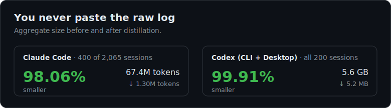
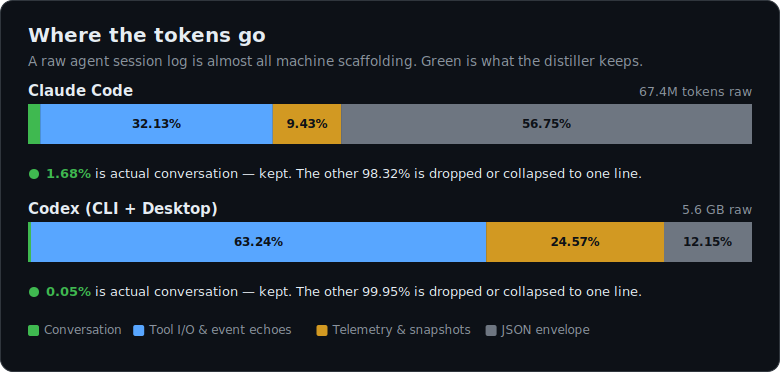

# agent-session-viewer

Export Claude Code or Codex (CLI/Desktop) session logs to clean JSON, then to a standalone HTML viewer.

A raw agent session log is **95–99.9% machine scaffolding** — JSON envelope, echoed
tool output, per-turn telemetry, compaction dumps. This tool distills a session down
to the conversation plus a one-line trace of each tool call, so you can hand a run to
another AI (or read it yourself) without drowning a fresh context in noise.

<p align="center"></p>

<p align="center"></p>

Measured over the author's own session stores (o200k_base proxy tokenizer; Codex
reduction measured in bytes over the whole store, cross-checked in tokens on a
seeded sample):

|                       | Claude Code            | Codex (CLI + Desktop) |
|-----------------------|------------------------|-----------------------|
| Sample                | 400 of 2,065 sessions  | all 200 sessions      |
| Raw                   | 67.4M tokens           | 5.6 GB                |
| Distilled             | 1.30M tokens           | 5.2 MB                |
| **Reduction**         | **98.1%**              | **99.9%**             |
| Median / session      | 5.6% kept              | 0.26% kept            |

The reduction climbs with session length — the largest Claude sessions (>400k tokens)
distill to **0.5%**, because long runs are almost entirely tool I/O and envelope, which
all drops. The win is biggest exactly where it matters: the long agent runs you actually
want to hand off.

**Subagents.** Codex runs each subagent as its own rollout file. Across the store all
**1,138 spawn events resolved** to their child rollout (100%); the parent always gets a
`spawned subagent: <path> — thread <id>` line, and `--with-subagents` inlines each
child's final report.

Charts regenerate with `python assets/make_charts.py` (stdlib only; numbers baked in).

## Usage

```bash
python clean_claude_session.py SRC.jsonl DST.json     # CC session → JSON
python clean_codex_rollout.py  SRC.jsonl DST.json     # Codex rollout → JSON
python clean_codex_rollout.py  SRC.jsonl DST.json --with-subagents  # + inline child reports
python render_conversation_html.py SRC.json [DST.html] # JSON → HTML
```

Both scripts emit `{source, messages: [...]}` with the same tiered shape: prose
turns (`role`: `user` | `assistant`), a per-turn `actions` list (tool calls,
triaged into keep-line / collapsed runs / dropped), and a `marker` for the
context-compaction boundary. See each module's docstring for the tiering rules.
`clean_claude_session.py` adds a `subagent` role (kept agent reports) and
`[decision]` user lines (AskUserQuestion answers). `clean_codex_rollout.py` adds
an `originator` field (`codex-tui` | `Codex Desktop` | …) since the Codex CLI and
Desktop share one session store. Codex runs each subagent as its own rollout
file, so the parent always gets a `spawned subagent: <path> — thread <id>` line;
with `--with-subagents` each child is resolved by its thread id (under
`$CODEX_HOME/sessions`) and its final report is inlined as a `subagent` message.

## Source files

macOS / Linux:
  - Claude Code: `~/.claude/projects/<cwd-slug>/<uuid>.jsonl`
  - Codex CLI & Desktop: `~/.codex/sessions/YYYY/MM/DD/rollout-*.jsonl` (both surfaces share this store)

Windows:
  - Claude Code: `%USERPROFILE%\.claude\projects\<cwd-slug>\<uuid>.jsonl`
  - Codex CLI & Desktop: `%USERPROFILE%\.codex\sessions\YYYY\MM\DD\rollout-*.jsonl`

Override defaults with `CLAUDE_CONFIG_DIR` or `CODEX_HOME`.

Python 3.9+, stdlib only. HTML viewer loads marked, highlight.js, mermaid, svg-pan-zoom from CDN.
